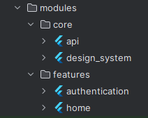

# Flutter Marvel App

Este é um aplicativo Flutter desenvolvido utilizando os princípios de SOLID e Clean Architecture, com modularização para melhor organização e escalabilidade do código. O projeto é construído sobre a arquitetura do Flutter Modular e integra-se à API da Marvel para fornecer informações sobre seus personagens e quadrinhos favoritos utilizando a paginação fornecida pela API.

|                                                                 Consuming API                                                                 |
|:---------------------------------------------------------------------------------------------------------------------------------------------:|
|  |

## Divisão de Módulos

## Funcionalidades Principais

- **Documentação da API:** https://developer.marvel.com/docs

- **Autenticação de Usuário:** Utilizamos o Firebase Auth para permitir que os usuários autentiquem-se no aplicativo de forma segura e rápida.

- **Consulta de Personagens e Quadrinhos:** A integração com a API da Marvel permite que os usuários pesquisem e explorem uma vasta gama de personagens e quadrinhos, com detalhes e imagens detalhadas.

- **Design Responsivo e Atraente:** O aplicativo foi desenvolvido com design cuidadoso e responsivo, garantindo uma experiência agradável em uma variedade de dispositivos e tamanhos de tela.
